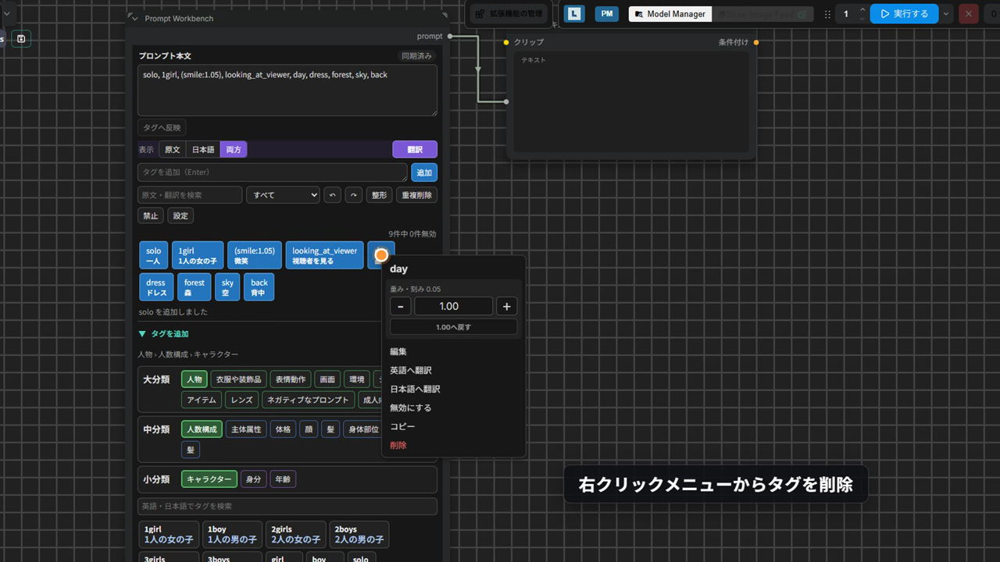
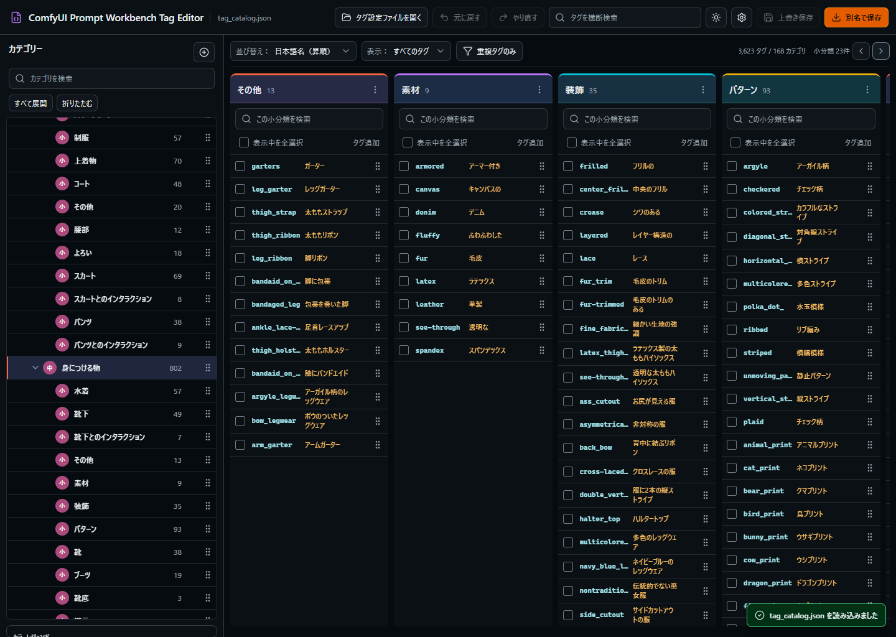

# ComfyUI-Prompt-Workbench

[日本語](README.md) | [English](README_EN.md)

ComfyUIでプロンプトをタグ単位に分解し、並べ替え、無効化、重み調整、翻訳、検索をまとめて行うカスタムノードです。

実行時の正本はComfyUI標準の複数行 `STRING` ウィジェットに残し、その上に編集しやすいタグUIを重ねます。UIが使えない環境でも、保存済みの `STRING` はそのまま出力できます。

## デモ

<video src="docs/assets/comfyui_prompt_workbench_intro.mp4" controls></video>

GitHub上で動画が表示されない場合は、[`docs/assets/comfyui_prompt_workbench_intro.mp4`](docs/assets/comfyui_prompt_workbench_intro.mp4) を開いてください。



> [!IMPORTANT]
> 本プロジェクトは、[Physton](https://github.com/Physton)氏による
> [sd-webui-prompt-all-in-one](https://github.com/Physton/sd-webui-prompt-all-in-one)
> の公式ComfyUI版ではありません。
> 直感的で強力なプロンプト編集体験を公開してくださったPhyston氏に、心より感謝いたします。
> 本ノードはその体験を参考にしながら、ComfyUI向けに独立して設計したものです。

## できること

- 単一のプロンプトを編集し、通常の `STRING` として出力できます。
- タグをドラッグで並べ替え、クリックで有効 / 無効を切り替えられます。
- タグの直接編集、削除、コピー、重複検出、複数選択、一括操作に対応しています。
- タグ重み、LoRA、LyCORISの強度を `0.05` / `0.1` / `0.25` 刻みで調整できます。
- 原文、翻訳、状態、種別、重複、ブラックリストでタグを絞り込めます。
- 大分類・中分類・小分類を持つローカルタグカタログからタグを検索・追加できます。
- タグセットを分類ツリーから探し、まとまったタグ群として追加できます。
- タグセットのお気に入り登録、検索、画像表示、リスト高さ調整に対応しています。
- ローカル辞書、MyMemory、LibreTranslate、DeepL、OpenAI互換APIを使った翻訳に対応しています。
- 原文 / 日本語 / 両方の表示を切り替えられます。
- 日本語タグを英語タグへ置換する翻訳ボタンがあります。
- LoRA、LyCORIS、Embedding、Wildcard、Dynamic Prompt、`BREAK` を識別します。
- TXTと状態JSONのImport / Exportに対応しています。
- ComfyUIのライト / ダークテーマに追従し、タグ種別ごとに色を設定できます。

タグの解析には、括弧、引用符、エスケープを追跡するステートマシン型パーサーを使っています。
ノード内ではComfyUI標準の右クリックメニューを抑止し、タグ専用メニューと入力欄の文字編集メニューだけを表示します。

## インストール

### ComfyUI Managerから入れる

通常はComfyUI Managerからのインストールを推奨します。

1. ComfyUIを起動し、`Manager` を開きます。
2. `Custom Nodes Manager` を開きます。
3. `ComfyUI Prompt Workbench` または `prompt-workbench` を検索します。
4. 検索結果の `Install` を押します。
5. インストールが終わったらComfyUIを再起動します。

Registryの公開ページは [ComfyUI Prompt Workbench](https://registry.comfy.org/nodes/prompt-workbench) です。
追加依存関係はありません。

開発中の変更を含む最新版は、[GitHubの `main` ブランチ](https://github.com/matsukasa/ComfyUI-Prompt-Workbench) にあります。
Manager版はRegistryへの反映タイミングにより、GitHub版より更新が遅れる場合があります。

### 手動で入れる

このフォルダを次の場所へ配置し、ComfyUIを再起動します。

```text
ComfyUI/custom_nodes/ComfyUI-Prompt-Workbench/
```

翻訳のHTTP通信には、ComfyUIに同梱されている `aiohttp` を使います。

### Portable版に入れる

Portable版では、Portableフォルダ内にあるComfyUIの `custom_nodes` へ配置します。

```text
ComfyUI_windows_portable/ComfyUI/custom_nodes/ComfyUI-Prompt-Workbench/
```

配置したら、普段使っている `run_nvidia_gpu.bat` などからComfyUIを再起動してください。

### Stability Matrixに入れる

Stability MatrixはPackageごとに `custom_nodes` が分かれます。
実際に起動するPackageのフォルダへ入れてください。

1. Stability Matrixで対象のComfyUI Packageを開きます。
2. Packageのデータフォルダを開きます。
3. `ComfyUI/custom_nodes/` へ本フォルダを配置します。
4. Stability MatrixからComfyUIを再起動します。

## 基本の使い方

1. ノード検索で `Prompt Workbench` を追加します。
2. 上部の本文欄、または下部の追加欄へタグを入力します。
3. 本文欄は `Ctrl+Enter` または `タグへ反映`、追加欄はEnterで確定します。
4. タグボタンをドラッグすると順序を変更できます。
5. タグボタンをクリックすると、有効 / 無効を切り替えられます。
6. ダブルクリックでタグを直接編集できます。
7. Ctrl / CmdまたはShift + クリックで複数選択できます。
8. 右クリックメニューから、重み、翻訳、コピー、移動、削除を操作できます。
9. `表示` で原文 / 日本語 / 両方を切り替えます。
10. `翻訳` ボタンを押すと、日本語タグは英語へ置換され、英語タグには日本語訳が追加されます。
11. `タグを追加` を開くと、カテゴリーや英語 / 日本語の名前からタグを検索して追加できます。
12. `タグセット` タブを開くと、分類済みのタグセットを検索してまとめて追加できます。
13. `prompt` 出力を、必要なノードの `STRING` 入力へ接続します。

無効タグはワークフロー内のUI状態として残りますが、`STRING` 出力からは除外されます。
ブラウザ拡張を読み込めないAPI実行やヘッドレス実行では、保存済みの `STRING` がそのまま出力されます。

## タグカタログとタグセット

Prompt Workbenchには、タグカタログとタグセットの2種類のローカルデータがあります。

- タグカタログ: 1つずつ追加するタグの辞書です。
- タグセット: よく使うタグのまとまりを分類して追加するためのデータです。

現在の同梱データは次の通りです。

| データ | 大分類 | 中分類 | 小分類 | 件数 |
| --- | ---: | ---: | ---: | ---: |
| タグカタログ `data/tag_catalog.json` | 10 | 39 | 159 | 2,922タグ |
| タグセット `data/tag_sets.json` | 5 | 17 | 46 | 323セット |

タグカタログの閲覧、検索、追加で外部タグサービスへ通信することはありません。
タグセットもローカルJSONから読み込まれます。

タグセットには、[アリス服飾店（@AliceLavli）様](https://x.com/AliceLavli) が公開されているプロンプトの一部を、ご厚意により収録させていただいています。使用を快く許可してくださり、本当にありがとうございます。どのプロンプトも雰囲気づくりや衣装表現の参考になる素敵なものばかりで、Prompt Workbenchのタグセットとして紹介できることをとても嬉しく思っています。この場を借りて、心よりお礼申し上げます。

### タグカタログを使う

`タグを追加` からタグカタログを開けます。
英語名、エイリアス、日本語の大分類・中分類・小分類名を検索できます。
タグボタンには英語名と日本語訳が表示されます。

SFW / 一般向けのカタログは `data/sfw_tag_catalog.json` として残しています。
必要な場合は、Prompt Workbench設定の `タグ管理` から `ファイルを選んで読み込む` で読み込んでください。
読み込んだファイルは、ComfyUIユーザーディレクトリの `prompt_workbench/tag_catalogs/` へ名前付きカタログとして保存されます。

Comfy Registryへ公開するパッケージでは、公開ワークフロー内で `data/sfw_tag_catalog.json` を `data/tag_catalog.json` として差し替えます。
そのため、Registry同梱版の既定カタログはSFW版です。

### タグセットを使う

`タグセット` タブから、分類済みのタグセットを検索して追加できます。
タグセットは、服装、髪型、構図、ポーズなど、複数タグをまとめて使いたい場面向けのプリセットです。
1クリックでタグ群を現在のプロンプトへ挿入できるため、衣装の細部、画面構成、体勢、雰囲気づくりなどを、毎回手入力せずに組み立てられます。

タグセットには、名前、日本語名、英語名、作者、参照URL、画像URL、画像パス、説明、タグ内容を持たせられます。
画面上では画像、名前、説明、タグ内容、作者、参照URLを確認できます。
挿入時は通常のタグ追加処理を通るため、既存タグとの重複処理、翻訳表示、ブラックリスト表示、ウィジェット同期は通常のタグ追加と同じように動きます。

星ボタンでタグセットをお気に入り登録できます。
お気に入りは `favoriteTagSets` としてノード設定に保存されます。
タグセット一覧はリサイズでき、表示高さは `tagSetListHeight` として保存されます。
検索欄ではタグセット名、英語名、説明、タグ本文、分類名を探せます。

既定のタグセットは `data/tag_sets.json` です。
別のタグセットJSONを使う場合は、Prompt Workbench設定の `タグ管理` からタグセットファイルを読み込んでください。
読み込んだファイルは、ComfyUIユーザーディレクトリの `prompt_workbench/tag_sets/` へ名前付きファイルとして保存されます。
同梱データを直接変更せずに、用途別のタグセットJSONを切り替えて使えます。

## 本体内でタグカタログを編集する

Prompt Workbench内の `タグ管理` 画面でも、タグとカテゴリーを編集できます。
タグ行の左端にある `⋮⋮` をドラッグすると、小分類内の表示順を変更できます。
編集したタグ集を残す場合は、タグ管理画面の下部にある `別名で保存` または `上書き保存` を使ってください。

内蔵デフォルトのカタログは上書きできません。
名前付きカタログの保存先は次の場所です。

```text
prompt_workbench/tag_catalogs/
```

保存JSONは `schema_version: 1` 形式です。
大分類、中分類、小分類、タグを `major_categories -> medium_categories -> small_categories -> tags` として階層保存します。
従来のフラットな `prompt-workbench/tag-catalog` version 1形式も引き続き読み込めます。

## Tag Editorで本格編集する

タグカタログやタグセットをまとめて整理したい場合は、専用のローカルWebアプリ
[ComfyUI Prompt Workbench Tag Editor](https://github.com/matsukasa/ComfyUI-Prompt-Workbench-Tag-Editor)
を使えます。



Tag Editorでは、次の操作に対応しています。

- タグカタログの大分類・中分類・小分類編集
- タグセットの大分類・中分類・小分類編集
- タグやタグセットのドラッグ移動、並べ替え、直接編集
- 複数選択、Undo / Redo、検索、重複検出
- 保存前preview、上書き保存、別名保存
- 差分ZIPのImport / Export

Import / ExportはTag Editor右上の歯車アイコン内にあります。
`差分を書き出す` では、Factory Defaultと現在の編集状態の差分だけをZIPにまとめます。Factory Defaultを読み込めない場合は、読み込み時の状態を比較元にします。
書き出し対象は `タグカタログのみ書き出し`、`タグセットのみ書き出し`、`両方書き出し` から選べます。

Import時は、manifest確認、patch確認、Import対象選択、再Import検出、競合検出、変更件数、エラー、進捗フェーズをpreviewで確認してから適用します。競合がある場合は、現在の設定を保持して停止するか、競合箇所はImport側を採用するか、競合箇所だけ今回スキップするかを選べます。
他のユーザーが追加した大分類・中分類・小分類は、タグカタログとタグセットの両方で追加されます。
削除操作は共有差分に含めず、古いZIPに削除operationが含まれていてもImport側では削除を無視します。自分が削除したDefault由来の項目は `prompt_workbench_meta` に記録されるため、後から同じDefault項目を含む差分ZIPをImportしても復活しません。
タグ、タグカタログ分類、タグセット分類、タグセットには `Default`、`Local`、`Imported` の由来が付き、行にマウスを置くと確認できます。Import適用前には現在のJSONをバックアップZIPとして書き出し、適用中に失敗した場合は画面上の編集状態を適用前に戻します。

Tag EditorはComfyUI本体とは独立して動くため、ComfyUIを起動していなくても `data/tag_catalog.json`、`data/sfw_tag_catalog.json`、`data/tag_sets.json` などを開いて編集できます。

## 状態JSONとお気に入り

`状態JSONを書き出す` では、Prompt Workbenchの状態を `prompt_workbench_state.json` として保存できます。
タグカタログのお気に入りは `settings.favorites` に含まれます。
タグセットのお気に入りは `settings.favoriteTagSets` に含まれます。

カタログやタグセットを差し替える前、または別環境へ移す前は、状態JSON、使用中のタグカタログJSON、使用中のタグセットJSONをあわせてバックアップしてください。

## 翻訳を使う

日本語への翻訳では、選択したプロバイダーに関係なく、最初に内蔵辞書と保存済みタグの日本語訳を使います。
見つからないタグだけを外部翻訳へ送信します。

既定の `無料翻訳（辞書→MyMemory）` では、不足分だけをMyMemoryへ送信します。
外部送信を避けたい場合は、`ローカル辞書のみ` を選んでください。

プロンプト本文に日本語タグがある場合、`翻訳` ボタンは最初にローカル辞書で英語を探します。
見つかったタグは本文内で英語へ置き換えます。
明示的な重み構文は維持されます。

Google Cloud Translationの公式APIには無料枠がありますが、Google Cloudプロジェクトと認証設定が必要です。
そのため、無設定の既定値にはしていません。

APIキーはノード、ワークフロー、ブラウザ設定へ保存しません。
ComfyUIを起動するプロセスの環境変数で設定してください。

| Provider | Environment variables |
| --- | --- |
| Local dictionary | 不要 |
| LibreTranslate | `PROMPT_WORKBENCH_LIBRE_URL`、任意で `PROMPT_WORKBENCH_LIBRE_API_KEY` |
| DeepL | `PROMPT_WORKBENCH_DEEPL_API_KEY`、任意で `PROMPT_WORKBENCH_DEEPL_URL` |
| OpenAI互換 | `PROMPT_WORKBENCH_OPENAI_API_KEY`、`PROMPT_WORKBENCH_OPENAI_MODEL`、任意で `PROMPT_WORKBENCH_OPENAI_BASE_URL` |

PowerShellで、現在の起動プロセスだけに設定する例です。
値は表示したりGitに保存したりしないでください。

```powershell
$env:PROMPT_WORKBENCH_DEEPL_API_KEY = "your-key"
```

設定後、同じPowerShellからComfyUIを起動します。
実装には、入力サイズ制限、最大30秒のタイムアウト、同時実行数制限、簡易レート制限、メモリ内キャッシュがあります。
詳細は [翻訳プロバイダー](docs/translation-providers.md) を参照してください。

## UI言語を切り替える

設定の `一般` -> `UI言語` から、日本語または英語を選択できます。
選択結果はワークフローへ書き込まず、そのブラウザ内だけに保存します。
変更はComfyUIの再読み込み後に反映されます。

UI文言は `web/locales/` にあります。
`en.json` は全翻訳キーを含むテンプレートです。
`ja.json` は日本語の元文を上書きしたい場合に使います。
プロンプトタグ用の `data/translations.json` はUI翻訳には使いません。

## 入力と同期の仕組み

タグボタンや追加操作は、対応する標準 `STRING` ウィジェットへ即時反映されます。
本文欄を直接編集した場合は、IME入力中の誤解析を避けるため、明示的な反映操作を行います。
ワークフロー読み込みや外部操作で `STRING` 値が変わった場合も、エディターが変更を検出して再解析します。

完全なタグ状態は、バージョン付きの `node.properties.promptWorkbenchState` へ保存します。
実行用 `STRING` とは分離されます。

## セキュリティ

- ユーザー文字列は `innerHTML` へ渡さず、フォーム値または `textContent` で描画します。
- APIキーはサーバープロセスの環境変数だけから取得します。
- Import JSONはスキーマ、件数、文字列長、1 MB上限を検証します。
- 正規表現は長さ制限と、危険なネスト量指定子の簡易拒否を行います。
- 翻訳URLは、サーバー管理者が設定したHTTP(S)環境変数だけを使います。
- `eval`、`new Function`、任意コード実行機構は使いません。

## 既知の制限

- ComfyUIのモデル一覧形式は構成により異なります。取得に失敗しても編集は使えますが、LoRA / Embeddingの存在警告が表示されない場合があります。
- 素のEmbedding名は通常タグと区別できません。確実に識別したい場合は `embedding:name` 形式を使ってください。
- 大量タグは250件ずつ段階表示します。完全な仮想スクロールではありません。
- DeepL、LibreTranslate、OpenAI互換は、有効な利用者設定がないため自動ライブ試験していません。
- AIによるプロンプト生成は対象外です。
- V3ノードスキーマへの移行は、安定APIと互換性要件を再評価してから行います。

## トラブルシューティング

### ノードが見つからない

`custom_nodes/ComfyUI-Prompt-Workbench/__init__.py` の位置を確認してください。
あわせて、ComfyUIの起動ログにimport errorが出ていないか確認します。

### UIが表示されない

ブラウザを強制再読み込みしてください。
それでも表示されない場合は、`WEB_DIRECTORY = "./web"` が読まれているか確認します。
`STRING` 出力自体はUIがなくても動作します。

### 翻訳が失敗する

設定したプロバイダーの環境変数、URL、利用上限を確認してください。
確認後、タグの翻訳ボタンから再試行します。

### モデルなし警告が誤っている

ComfyUIの `/object_info` または `/embeddings` を取得できるか確認してください。
警告は実行を止めません。

### タグセットが表示されない

設定の `タグ管理` でタグセットファイルの読み込み状態を確認してください。
破損したJSONや対応外schemaの場合は、読み込みエラーになります。
未指定の場合は同梱の `data/tag_sets.json` を使います。

## アンインストール

ComfyUIを終了し、`custom_nodes/ComfyUI-Prompt-Workbench` フォルダを別の場所へ退避するか削除してから再起動します。
既存ワークフローには未登録ノードとして残るため、必要な場合はアンインストール前に `STRING` を別ノードへコピーしてください。

## ライセンス

本プロジェクトはMIT Licenseです。
由来データの出典とライセンスは [第三者表記](THIRD_PARTY_NOTICES.md) に記録しています。
